# Autenticación con Google OAuth 2.0 🚀

## 📌 Índice de Contenidos
- [Introducción](#-introducción)
- [Conceptos Básicos](#-conceptos-básicos)
- [Pasos Detallados](#-pasos-detallados)
- [Configuración Técnica](#-configuración-técnica)
- [Resolución de Problemas](#-resolución-de-problemas)

## 🎯 Introducción

### ¿Qué es OAuth 2.0?
OAuth 2.0 es un protocolo de autorización que permite a las aplicaciones obtener acceso limitado a cuentas de usuario en servicios como Google, sin exponer las credenciales de contraseña.

### 🌟 Beneficios para VideoClub
- Autenticación segura
- Experiencia de usuario simplificada
- Sin gestión de contraseñas
- Identidad verificada por Google

## 🛠 Conceptos Básicos

### Términos Clave
- **Client ID**: Identificador público de tu aplicación
- **Client Secret**: Clave privada para autenticar tu aplicación
- **Scope**: Permisos solicitados al usuario
- **Callback URL**: Dirección de redirección tras autenticación

## 🚀 Pasos Detallados
## Paso 1: Crear un Proyecto en Google Cloud Console 🌐

### 1.1 Accede a Google Cloud Console

1. Abre tu navegador y ve a [https://console.cloud.google.com/](https://console.cloud.google.com/)
2. Inicia sesión con tu cuenta de Google
3. Selecciona APIs y Servicios
   
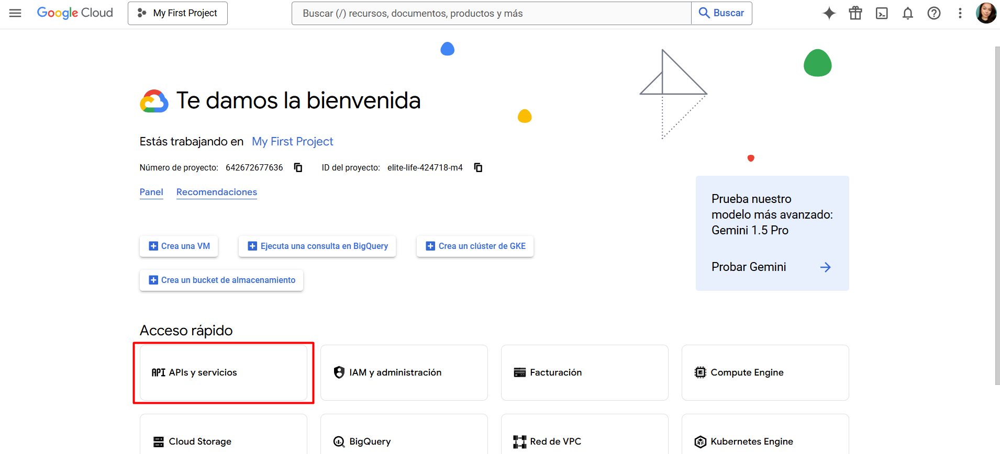

### 1.2 Crear un Nuevo Proyecto

1. Haz click en el botón "Crear proyecto"
2. Escribe un nombre para tu proyecto (por ejemplo, "VideoClub")
3. Haz click en "Crear"

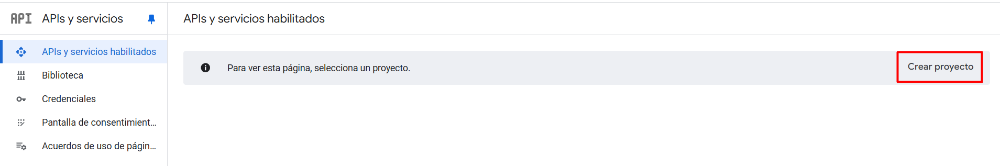

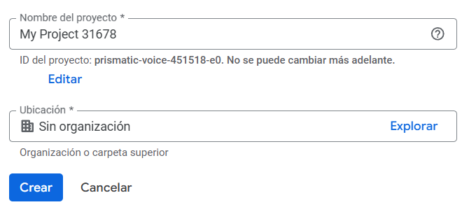

### 1.3 Accede a la Configuración de OAuth
3. Aparecerá una lista de opciones en el menú lateral izquierdo.
4. Haz click en "Credenciales"

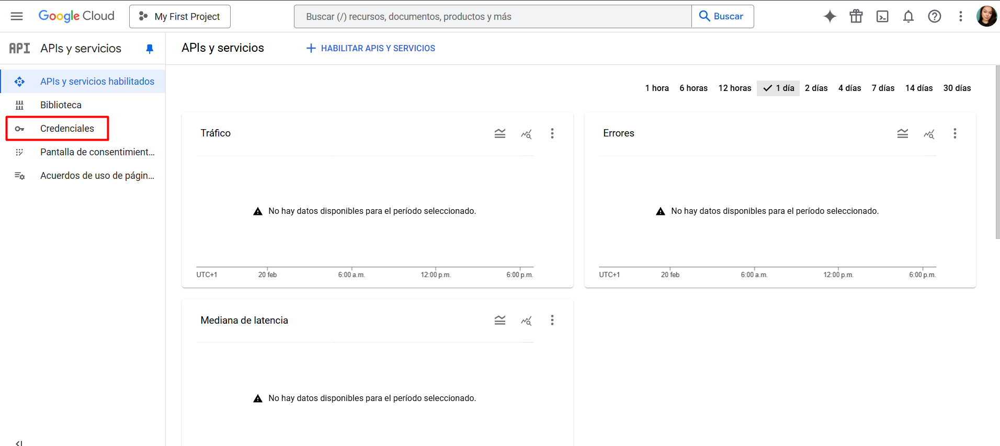

### 1.4 Accede a la Configuración de OAuth

1. Haz click en "Crear credenciales"
2. Selecciona "ID de cliente de OAuth"

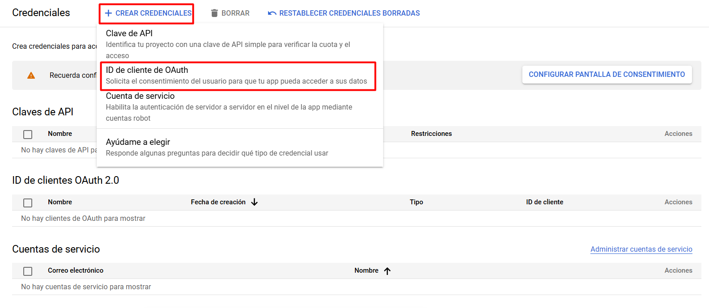

## Paso 2: Configurar Pantalla de Consentimiento de OAuth 🔐

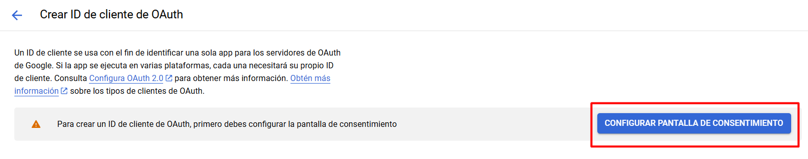

### 2.2 Completar Información del Formulario

1. Nombre de la aplicación: Escribe el nombre de tu proyecto
2. Correo electrónico de asistencia de usuario: Tu correo electrónico
   
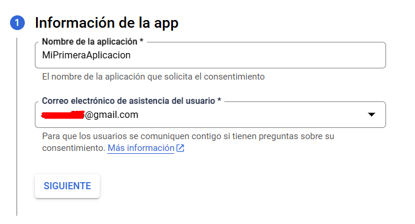

1. Selecciona "Externo" para que puedan acceder a la aplicación con cualquier cuenta de Google
   
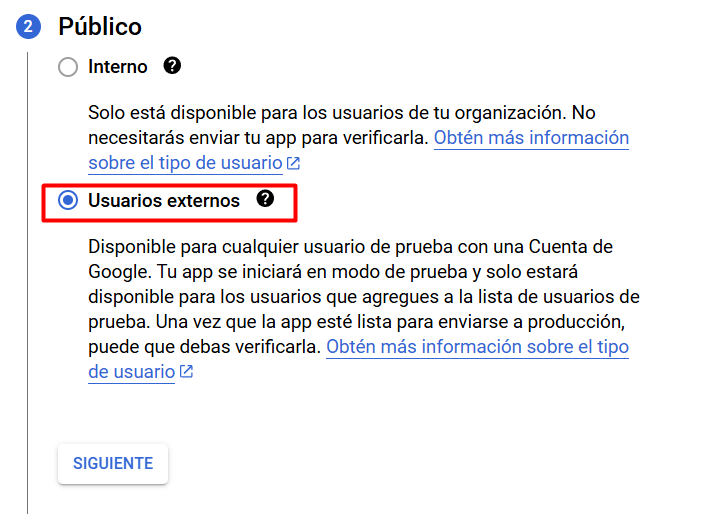

4. Añade la dirección de contacto para notificaciones sobre el proyecto desde Google
   
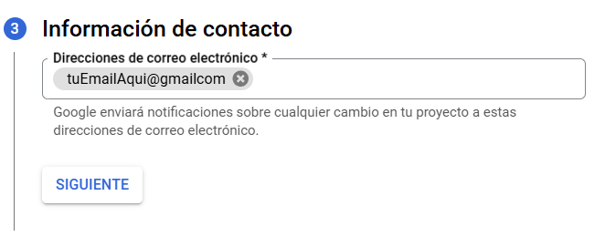

### Haz clic en "Guardar y continuar"  


## Paso 3: Crear Cliente de OAuth 🔑

### 3.2 Configurar Tipo de Aplicación

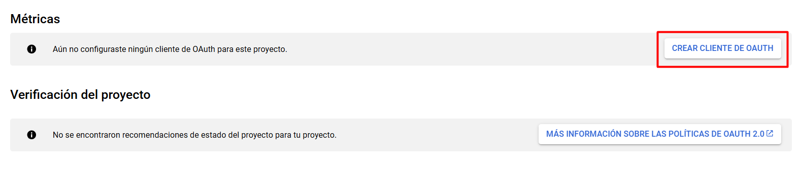

1. Tipo de aplicación: "Aplicación web"
2. Nombre: Escribe un nombre descriptivo

### 3.3 Configurar URLs Autorizadas

Añade las URLs autorizadas:
- `http://localhost`
- `http://localhost:5173`
- `http://localhost:4000`
- `http://localhost:80`

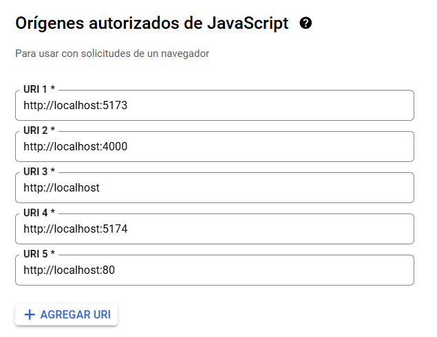

Añade estas URLs de redireccionamiento:
- `http://localhost:5173/login`
- `http://localhost:4000/api/auth/google/callback`
- `http://tu-dominio-en-produccion/login`
- `http://tu-dominio-en-produccion/api/auth/google/callback`

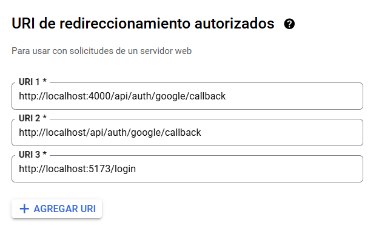

### Haz clic en "Guardar"

## Paso 4: Obtener Credenciales 📋

### 4.1 Copiar Credenciales

1. Verás dos valores importantes:
   - ID de cliente
   - Secreto de cliente

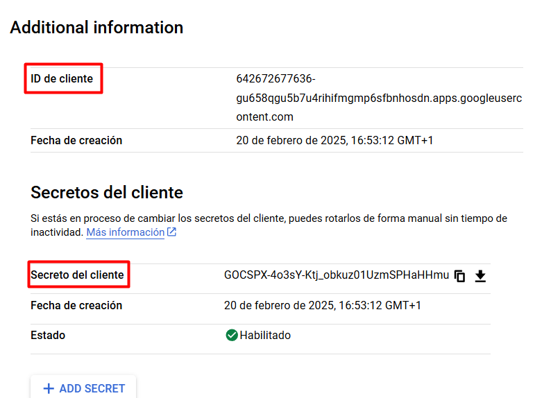

## Paso 5: Configurar Variables de Entorno 🌍

### Backend (.env)
```bash
# Credenciales de Google
GOOGLE_CLIENT_ID=tu_client_id_aqui
GOOGLE_CLIENT_SECRET=tu_client_secret_aqui
OAUTH_CALLBACK_URL=http://localhost:4000/api/auth/google/callback
```

### Frontend (.env)
```bash
VITE_API_URL=http://localhost:4000/api
VITE_OAUTH_CALLBACK_URL=http://localhost:4000/api/auth/google/callback
```

## Paso 6: Configurar Passport.js 🔐

### Instalación de Dependencias
Primero, instala las dependencias necesarias:
```bash
npm install passport passport-google-oauth20 passport-github2 express-session
```

> [!IMPORTANT]
> Es crucial instalar `express-session` ya que Passport.js lo requiere para mantener las sesiones de usuario.


En el backend, en la carpeta config, crea un archivo llamado `passport.js`

```javascript
passport.use(
  new GoogleStrategy(
    {
      clientID: process.env.GOOGLE_CLIENT_ID,
      clientSecret: process.env.GOOGLE_CLIENT_SECRET,
      callbackURL:
        process.env.OAUTH_CALLBACK_URL ||
        "http://localhost:4000/api/auth/google/callback",
      passReqToCallback: true,
      proxy: true,
      scope: ["profile", "email"],
    },
    async (req, accessToken, refreshToken, profile, done) => {
      try {
        let user = await User.findOne({ email: profile.emails[0].value });

        if (user) {
          // Si el usuario existe pero no tiene googleId, actualízalo
          if (!user.googleId) {
            user.googleId = profile.id;
            // Establece la contraseña como null para usuarios de OAuth
            user.password = null;
            await user.save();
          }
          return done(null, user);
        }

        // Crear nuevo usuario
        user = new User({
          username: profile.displayName,
          email: profile.emails[0].value,
          googleId: profile.id,
        });

        await user.save({ validateBeforeSave: false });
        return done(null, user);
      } catch (error) {
        return done(error, null);
      }
    }
  )
);
```

## Paso 7: Configurar Rutas de Autenticación 🌐

En el backend, en la carpeta routes, si tienes un archivo llamado `authRoutes.js` o similar, configura lo siguiente:

```javascript

router.get(
  "/google",
  passport.authenticate("google", {
    scope: ["profile", "email"],
    prompt: "select_account",
  })
);

router.get(
  "/google/callback",
  passport.authenticate("google", {
    failureRedirect: process.env.FRONTEND_URL + "/login",
  }),
  handleOAuthCallback
);
```

## Paso 8: Implementar en Frontend 💻

En el frontend, en la carpeta context, crear un contexto que maneje el login con google:

```javascript
 const handleSocialLogin = async (provider) => {
    try {
       window.location.href = `${
         import.meta.env.VITE_API_URL
       }/auth/${provider}?callbackUrl=${encodeURIComponent(
         window.location.origin + "/login"
       )}`;
    } catch (error) {
      console.error(`Error en login con ${provider}:`, error);
      throw error;
    }
  };

  const loginWithGoogle = () => handleSocialLogin("google");
```
## 🐛 Resolución de Problemas

### Errores Comunes
1. **Error 401 (No Autorizado)**
   - Verifica Client ID y Client Secret
   - Confirma URLs de redireccionamiento

2. **Problemas de CORS**
   - Configura middleware de CORS
   - Verifica orígenes permitidos

## 📚 Recursos Adicionales
- [Documentación Oficial de Google OAuth](https://developers.google.com/identity/protocols/oauth2)
- [Passport.js Documentation](http://www.passportjs.org/)
  
- [Documentación Oficial de GitHub OAuth](https://docs.github.com/en/apps/creating-oauth-apps/about-creating-oauth-apps)


---

> [!NOTE]
>El proceso de autenticación con Google es el mismo para GitHub.
