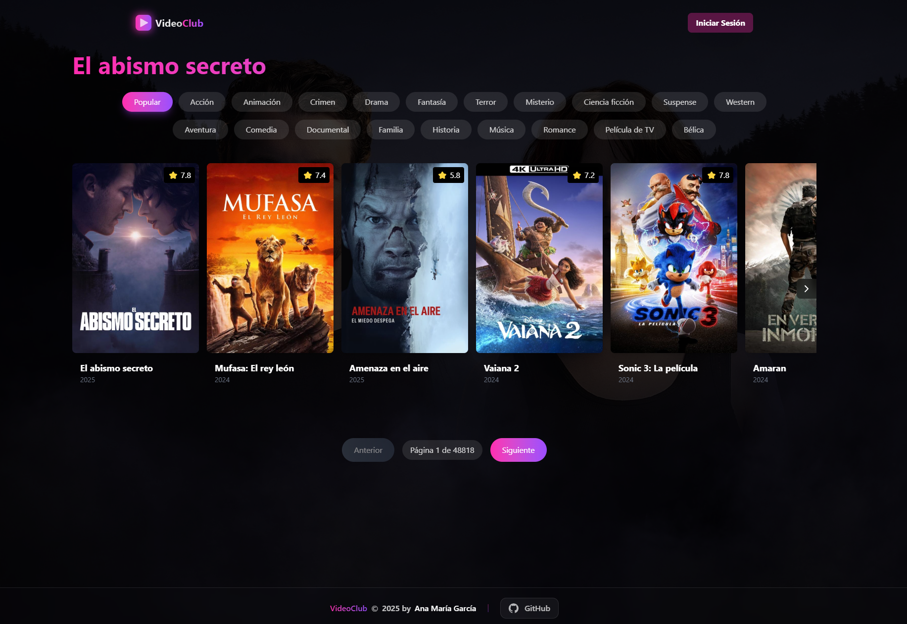
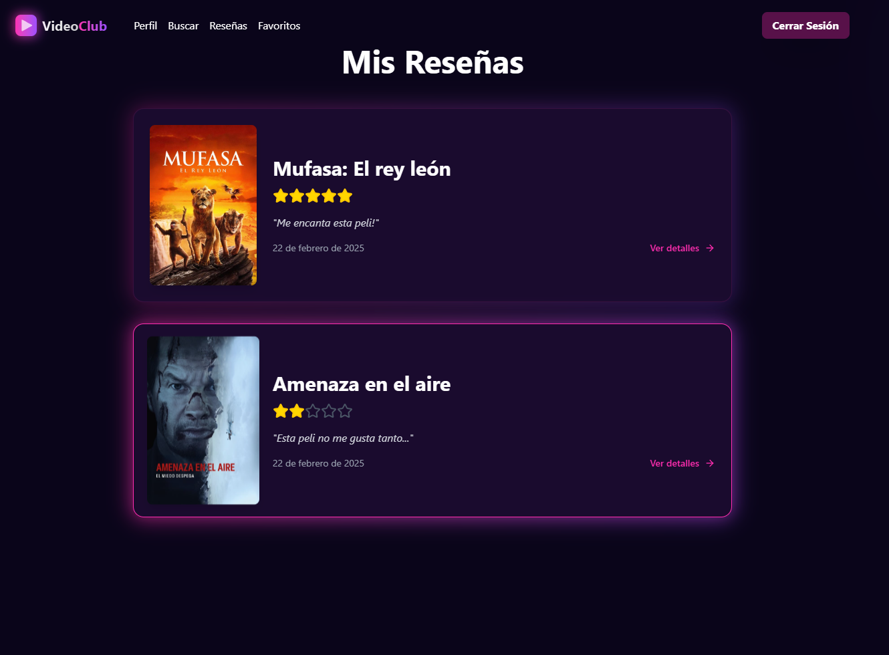
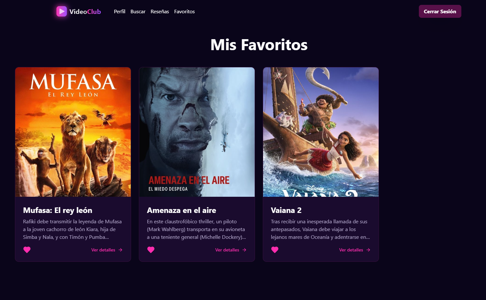
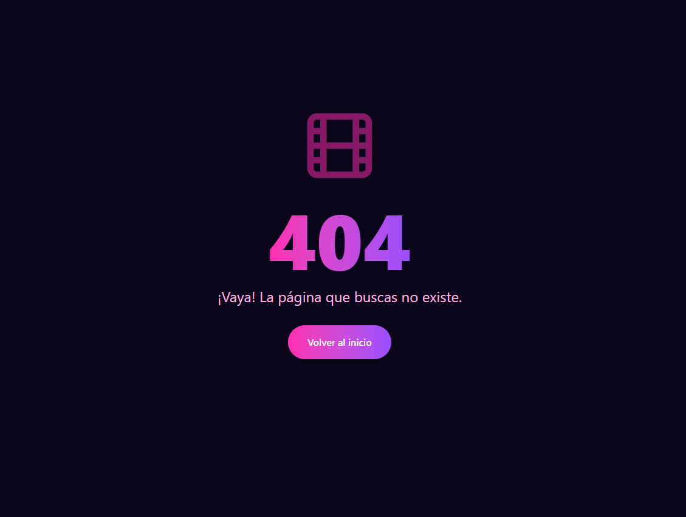
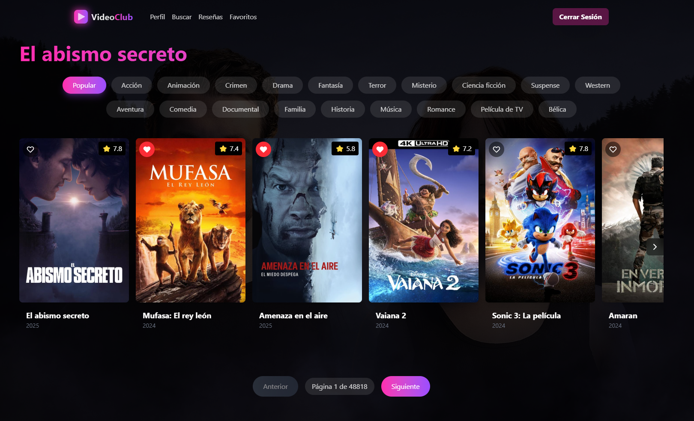

# Documentación de la Interfaz - VideoClub

## 📖 Introducción
El **VideoClub** es una aplicación web que permite a los usuarios **explorar, buscar y gestionar películas**. Los usuarios pueden registrarse mediante email o Google para acceder a funcionalidades como guardar favoritos y escribir reseñas. La aplicación ofrece una interfaz elegante y moderna, con un diseño en tonos oscuros y acentos en morado y rosa.

---

## 🚀 Flujo de la Aplicación

### **1 Vista Principal**
La página principal muestra un carrusel de películas populares con un diseño elegante y gradientes. Los usuarios pueden navegar por diferentes categorías y ver las películas más recientes.

---

### **Sistema de Autenticación**
Los usuarios pueden registrarse e iniciar sesión mediante:
- Email y contraseña
- Google OAuth

---

### **Peril**
Los usuarios autenticados pueden consultar su perfil, donde podrán:
- Ver sus reseñas
- Ver su lista de favoritos
- Cerrar sesión (a parte del navbar)

---

### **Sistema de Reseñas**
Los usuarios pueden:
- Consultar que reseñas han hecho
- Ver los detalles de la película

---

### **Búsqueda de Películas**
Los usuarios pueden buscar películas por:
- Título
- Año
- Puntuación
- Género

> [!NOTE]Se puede buscar de dos formas:
> - Buscando por el input de texto
> - Buscando solo por filtros
> 
> Por ejemplo se puede buscar "Pokemon" y filtrar por el año 1982 o solo buscar películas de acción sin añadir texto.

---

### **Detalles de Película**
Cada película tiene una página detallada que muestra:
- Póster de fondo de pantalla
- Portada
- Sinopsis
- Puntuación
- Reseñas
- Botón para añadir a favoritos
- Botón para ver el trailer (si existe)

---

### **Detalles de Película V2**
En cada pantalla de detalle de película se puede añadir y ver reseñas:
Cada reseña contiene:
- Puntuación
- Reseña
- Nombre del usuario que la escribió
- Fecha de creación

---

### **Gestión de Favoritos**
Los usuarios autenticados pueden:
- Añadir películas a favoritos
- Ver su lista de favoritos
- Eliminar películas de favoritos

---

### **Error Page**
Si se intenta acceder a una página que no existe se mostrará una página de error:

---

### **Detalles**
Se han implementado detalles como toast (notificaciones) para indicar al usuario que se ha realizado una acción,
Además se han implementado detalles como iconos toggleables para indicar que las películas están añadidas a favoritos o no.

---

## 🎨 Diseño y Estilo
La aplicación utiliza:
- Gradientes de morado (#9B4DFF) a rosa (#FF2DAF)
- Efectos de blur y transparencia
- Animaciones suaves
- Diseño responsive

---

## 🛠 Levantando el Proyecto

### **1️⃣ Levantar con Docker**